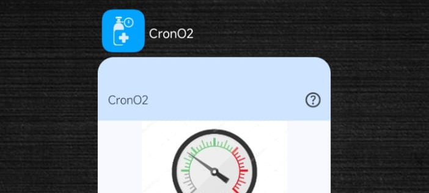

# CronO2

## Description
This repository is based on my project developed as final work for [Certificate of Higher Education (HNC)](https://www.inesem.es/revistadigital/idiomas/equivalencia-de-estudios-como-traducir-tus-titulaciones-al-ingles-uk-2/) on Cross-platform application development.
The project focuses on developing a mobile application for Android to calculate the remaining oxygen supply time for cylinders used in emergency medical services.
**This content is still in development and may not be fully optimized or free of errors.**

In some situations, healthcare professionals may work with a diverse inventory of oxygen cylinders and pressure gauges that lack a standardized format. Additionally, pressure gauges can display values in different units of measurement, making it difficult to estimate the remaining oxygen supply accurately.
This app is designed to provide estimations across various measurement units and formats, helping ensure an adequate oxygen supply throughout service operations.

## Technologies Used

## Project Status
**This project is constantly evolving** as I continue learning and improving my skills. The code is still under development and optimization, meaning some features may be incomplete or under review.
- The app can be used as a quick converter between pressure units.
- A built-in quick user guide ensures easy access to essential information.
- A clean, consistent, and user-friendly interface presents all necessary data without requiring screen changes.
- Supports both English and Spanish through internationalization.
- Accuracy tests comparing the app’s calculations with reference tables from oxygen cylinder suppliers show significant variability depending on the manufacturer. While the goal is to keep the margin of error below 5%, precision rates currently range between 6% and 100%. Further analysis is needed to improve reliability.

## [This is how it works](https://youtube.com/shorts/Pq6sdgn_GHg?feature=share)

## Installation & Usage
The application is currently available only in this repository.

1. Clone this repository
2. Open it in Android Studio
3. Build and run it on an emulator (API 24+) or a physical device

## Planned Improvements
- Implement a pressure gauge graphic using Canvas, allowing users to manually adjust the needle.
- Add customization options for cylinder parameters based on the manufacturer.
- Expand DataStoreManager attributes to include user preferences (dark mode, default cylinder values, etc.).

## Notes
- **Personal Use:** This code is primarily for learning and experimentation.
- **Not for Production Use:** This repository is not intended for deployment in production environments or other projects without prior review.
- **Not a substitute for official medical supply management**. This project is an educational programming exercise and does not yet contain the necessary information for its intended end users.

---
Thank you for visiting CronO2! I'm continuously learning, so any suggestions or feedback are always welcome.